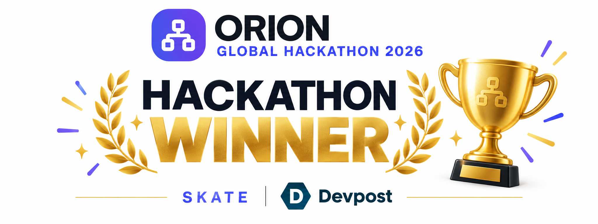
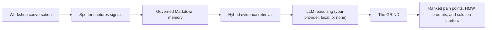
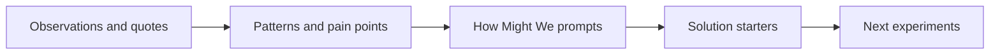
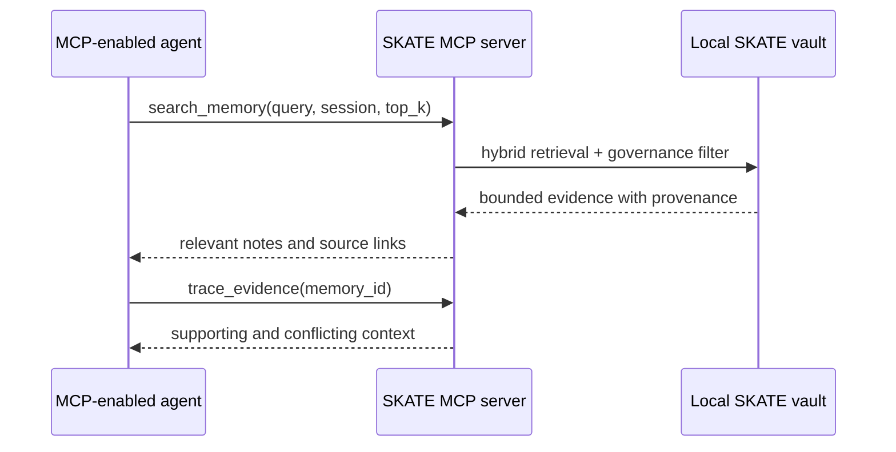

<p align="center">
  
</p>

<h1 align="center">SKATE</h1>

<p align="center"><strong>Scalable Knowledge Architecture &amp; Technology Engine</strong></p>

<h3 align="center">Local-first Workshop Memory &amp; Evidence-Based Improvement Engine</h3>

<p align="center">
  Turn live improvement workshops into governed organizational memory, retrieve only the evidence that matters, and generate traceable, ranked improvement opportunities your team can act on.
</p>

<p align="center">
  
  
  
  
  
  <a href="LICENSE"></a>
</p>

<p align="center">
  <a href="https://orionhackathon.com/"></a>
</p>

<p align="center">
  <strong>🏆 Productivity &amp; Enterprise Solutions Winner — <a href="https://orionhackathon.com/">Orion Global Hackathon 2026 on Devpost</a></strong>
</p>

> *You can't vibe code personality.* SKATE has attitude: skateboard themes, Spotter, The GRIND, and actions you land. Built for the energy of a real workshop, with human judgment at the center.

---

## Hackathon winner

SKATE was one of several winning apps in the [Orion Global Hackathon 2026](https://orionhackathon.com/), earning recognition as a winner in **Productivity & Enterprise Solutions**.

| | |
|---|---|
| **Event** | [Orion Global Hackathon 2026](https://orionhackathon.com/) — Where Operations Research Meets Innovation |
| **Category** | **Productivity & Enterprise Solutions** |
| **Recognition** | **Winner — Productivity & Enterprise Solutions** |
| **Current source** | v1.2.0 — September workshop updates; testing continues |

---

## The problem

Operations improvement lives and dies in workshops: kaizen events, root-cause sessions, design-thinking sprints, voice-of-customer reviews. These sessions create some of an organization's most valuable knowledge — and some of its most disposable. Observations, decisions, pain points, quotes, and unanswered questions disappear into notebooks, raw meeting transcripts, and disconnected AI summaries. When a team revisits the work, it either starts over or sends an entire transcript back to a model and hopes the important evidence is still visible.

The result is a measurable operations problem: repeated discovery work, decisions divorced from their supporting evidence, and improvement actions that lose their provenance the moment the meeting ends.

## The solution

**SKATE is a workshop operating system, not another note-taking app.** It captures natural meeting notes, preserves important signals as typed and linked memory, retrieves a bounded evidence set for AI reasoning, and turns that evidence into a traceable, ranked design-thinking synthesis — from observations to pain points to How-Might-We prompts to concrete solution starters.

Its hybrid memory combines a **typed knowledge graph, optional local vector search, and keyword retrieval**. Graph links explain how evidence connects; vector search finds related meaning. Markdown files remain the source of truth, with local embeddings providing the semantic index. SKATE is free, MIT-licensed software; optional cloud providers bill separately.



## Where operations research meets innovation

SKATE treats a workshop as a data-generating process and applies a disciplined pipeline to it:

- **Structured capture** — seven quick-capture markers cover `#P` pain, `#O` observation, `#A` action, `#Q` question, `#S` solution, `#R` recommendation, and `#I` insight. Notes can also use one of 14 object types, including decision and risk.
- **Governed evidence** — every memory object has YAML metadata, active/inactive status, themes, provenance, and typed relationships (`supports`, `contradicts`, `causes`, `leads_to`, `references`). Analysis runs only on governed, in-scope evidence.
- **Bounded retrieval instead of brute force** — weighted lexical scoring plus optional local semantic embeddings return a small, ranked Top-K evidence set instead of an entire transcript. Every retrieval number ships with its configuration and a chance baseline, and reproduces from a harness in the repo — see [Measured, not claimed](#measured-not-claimed).
- **Traceable synthesis** — every generated pain point, How-Might-We prompt, and solution starter links back to its source notes, so decisions keep their evidence chain.
- **Prioritized output** — the full ranked synthesis exports to Excel for a workshop readout or an improvement backlog.

## New in the 1.2.0 source update

Testing is continuing. These additions are in the source; packaged apps need a new build. Installer downloads are published separately on [GitHub Releases](https://github.com/SixSigmaEngineer/skate-workshop-os/releases).

- **Record a Meeting, keep both files.** Capture PC audio and your microphone, create a session from the recording dropdown, and save a WAV plus a linked transcript note. Audio is saved before transcription, so it remains available if transcription fails.
- **Quick capture from the Windows tray.** Right-click the SKATE icon and choose **Record computer + microphone (Unassigned)**. New Spotter Live recordings default to Unassigned unless you explicitly choose a session or arrive from a session link.
- **Move between recording and notes.** Spotter Live stays running while you visit other screens. Return using the recording-status link; your workspace and note drafts are preserved during navigation.
- **Text chat when you want it.** Turn off **Read replies aloud** in Spotter Live. In both Spotter screens, **Enter** sends and **Alt+Enter** adds a line. Live chat also guards against displaying response schemas instead of an answer.
- **Keep the original and the cleaned version.** **Use reviewed notes** archives the untouched source; **Save Memory Object** links both versions for MCP. Expand **Original notes & transcripts** to read it. Repeated cleanup retains earlier originals. Summary prose focuses on the work, with hashtags unchanged.
- **Skate merit badges and clearer Stats.** Thirteen illustrated badges cover eight levels and five milestones. Harborlight demo sessions earn no XP or milestone credit. Token estimates recalculate from current active notes and compare a sample excerpt scenario with full note bodies; they are not cumulative usage or dollar savings.
- **Review Connections guidance.** A compact info popup explains suggested metadata and evidence links; you choose which proposals to apply.
- **OneNote import guidance.** Export pages or sections to Word `.docx`, then preview folder-to-session grouping and optional heading splits. This is a text-only importer: embedded photos/files are not copied, PDF has no OCR, and `.one`, `.onepkg`, `.mht`, `.xps`, and notebook ZIPs are unsupported.
- **Reliability and crew credits.** Long action titles no longer break note filenames; save failures keep entered values. About permanently thanks founding testers **Brian Khorshad** and **Joe Wise**, with space for future crew members.
- **Recording controls in the tray.** Closing the desktop window hides SKATE while capture continues. A skateboard means not recording; a red circle means recording. Hover for status and elapsed time, or right-click to start **Record computer + microphone (Unassigned)** or **Stop recording & save**. Keep SKATE running until **Audio & transcript saved** appears.
- **Long-workshop cleanup with progress.** Review the complete transcript in sections, with up to three concurrent cloud requests and a **Stop cleanup** control. Review or edit the proposal before applying it; the original text is preserved as an attachment. An optional workshop focus helps separate useful evidence from chatter. No AI mode uses local rules and still needs human review.
- **A graph you can navigate as workshops grow.** All sessions opens with signals collapsed. Browse up to 80 notes per page, then explore a selected note's signals in pages of 40 with type filters. Search reaches every note and signal in scope. Fewer labels and a layout that settles reduce clutter and repeated calculations; the full graph still loads for search.
- **Recoverable removal and key controls.** Trash icons remove a note or session, and the Trash page restores it. Settings lets you remove saved API keys without replacing them.
- **Larger imports, readable exports, and personality.** Audio/video imports support 2,048 MB by default, adjustable to 4,096 MB with faster-whisper, and transcribe in ten-minute sections. Print notes or sessions to PDF, choose skateboard themes, and explore the Info page's recording walkthrough and interactive 3D board.

See [September 2026 updates](SEPTEMBER_2026_UPDATES.md) for the full changes, verification, and remaining testing.

## What works today

| Capability | Status |
|---|---|
| Local-first Markdown/YAML memory with typed relationships | Working |
| Spotter and Spotter Live workshop capture | Working |
| Live transcription and spoken agent talk-back (OpenAI realtime voice) | Working |
| Local Whisper and optional ElevenLabs speaker diarization | Working |
| 2D/3D knowledge graph with paged notes and signal detail; Excel export | Working |
| GRIND design-thinking synthesis | Working |
| Choice of AI provider: OpenAI, Anthropic, OpenRouter, local LM Studio, or no AI at all | Working |
| The Lineup for flexible, session-linked, and recurring Standard Work actions | Working |
| Skater levels: gamified progress from Grom to 900 Legend on the Stats page | Working |
| MCP server for MCP-enabled agents: governed reads plus additive writes (STDIO and Streamable HTTP) | Working |
| Agent access to The Lineup via MCP (`get_lineup`) | Working |
| One-click MCP setup for both Codex/ChatGPT desktop and Claude Desktop (classic and Microsoft Store installs) | Working |
| Windows installer with bundled MCP executable | Working |
| App-agnostic meeting recorder — records what the PC hears (Teams, Zoom, Meet, Webex, anything), no bot in the call, local transcription | Working |
| Saved WAV + transcript, recording-status tray icon, and stop-and-save from the tray | Added in 1.2.0 source; desktop testing continues |
| Reviewed transcript cleanup with progress, cancellation, and original-text attachment | Working |
| Recoverable note/session Trash, saved API-key removal, and note/session PDF views | Working |
| Paste (Ctrl+V) or drag screenshots and files into notes, stored in the session folder with a visual gallery | Working |
| Bounded AI synthesis payload with relevance-based selection over long notes and transcripts | Working |
| Reproducible retrieval benchmark with analytic chance baselines (`tools/benchmark_retrieval.py`) | Working |
| Self-bootstrapping launcher: finds a compatible Python or installs one privately, no admin rights | Working |

## Six core capabilities

- **Governed local memory** — human-readable Markdown with YAML metadata, active/inactive governance, themes, provenance, and typed relationships such as `supports`, `contradicts`, `causes`, `leads_to`, and `references`.
- **Evidence-backed retrieval** — weighted lexical search plus optional local semantic embeddings retrieves a small, relevant evidence set instead of repeatedly loading a complete vault or transcript.
- **Spotter and Spotter Live** — capture manual notes, listen to a room with live transcription, and hear Spotter respond with voice. Local Whisper provides a private fallback; ElevenLabs remains optional for realtime speaker labels.
- **The GRIND** — explore memory as a 2D/3D graph, identify patterns across a session, generate IDEO-style outputs, trace results to source notes, and export the full ranked synthesis to Excel.
- **The Lineup** — manage flexible or session-linked Action Items, mark completed work as Landed, maintain daily/weekly/monthly Standard Work, and promote `#A` bullets from ordinary notes into traceable checklist items.
- **A physical workshop interface** — an Elgato Stream Deck Neo and a custom skateboard-wheel microphone puck give the agent a practical human-machine interface in the room.

## Why SKATE is different

| Traditional AI notes | SKATE |
|---|---|
| Produces a meeting summary | Builds governed organizational memory |
| Sends a full transcript as context | Retrieves a bounded set of relevant evidence |
| Stores flat pages or informal backlinks | Maintains typed evidence and causal relationships |
| Centers a chat box | Operates as a workshop capture and synthesis system |
| Applies generic summarization | Follows a design-thinking path from evidence to action |
| Hides the source of an answer | Links outputs back to inspectable source notes |
| Ends with prose | Produces ranked pain points, How-Might-We prompts, solution starters, and Excel outputs |
| Loses follow-through in meeting notes | Surfaces captured actions in The Lineup and preserves their source-note link |

Obsidian is an excellent personal knowledge workspace. SKATE addresses a different job: helping facilitators and improvement teams convert a live, multi-person workshop into governed, reusable evidence and then deliberately synthesize that evidence into improvement opportunities.

## Not another meeting notetaker

The other category SKATE gets compared to is the meeting notetaker — Granola, Otter, Fireflies, Spinach. Fine products for personal use, but they record meetings; SKATE remembers engagements. The differences are structural, and they matter most in exactly the rooms where enterprise productivity tools get used — client engagements, HR conversations, legal and strategy sessions:

| | SKATE | The notetaker category |
|---|---|---|
| **How it captures** | Records what the PC hears — any meeting app, no bot joining the call | A visible bot joins the call, or capture routes through the vendor |
| **Calendar and tenant access** | None requested, ever | A Google/Microsoft calendar connection is commonly required for auto-join |
| **Where your audio goes** | Never leaves the machine — transcription is local | Vendor-cloud transcription and summarization |
| **Vendor training on your content** | Impossible: there is no vendor | Varies by vendor and plan; some train by default unless you opt out |
| **What you get back** | Governed, typed, linked memory plus a ranked design-thinking synthesis | A summary and an action list |
| **Price** | $0 — MIT-licensed, self-hosted | Per-user monthly SaaS |

Even the notetaker with the closest capture model still transcribes every recording in its own cloud. For confidential material, local-only processing is not a preference — it is the difference between a productivity tool and a data-governance decision. SKATE is the only option in the comparison that removes the vendor entirely.

## Architecture


The local vault remains the source of truth. Search indexes and embeddings are rebuildable acceleration layers, not proprietary memory. Cloud services are explicit and optional except when the user requests their capabilities.

## Bring your own AI — or none at all

SKATE is deliberately not locked to any AI vendor. Pick the reasoning engine that fits your privacy posture and budget in Settings:

| Provider | What it means |
|---|---|
| **No AI** | Every non-model feature still works: capture, governance, retrieval, graphs, The Lineup, exports, and a deterministic local synthesis. Nothing ever leaves the machine. |
| **LM Studio** | A local LLM on your own hardware through LM Studio's OpenAI-compatible server. Private reasoning, no API key. |
| **OpenAI** | GPT-5.6 family through the Responses API, with selectable reasoning effort. |
| **Anthropic** | Claude Sonnet, Opus, or Haiku through the Messages API. |
| **OpenRouter** | Any hosted model — Claude, GPT, Gemini, Llama, Mistral — with a single key. |

The same vendor-agnostic stance applies to agent access: the installer can register SKATE's MCP server with **Codex/ChatGPT desktop and Claude Desktop** in one click each.

## AI reasoning: synthesis, not summarization

The central AI task in SKATE is not "summarize this meeting." It is a constrained, evidence-heavy reasoning problem across multiple notes: recognize recurring tensions, distinguish observations from proposed solutions, preserve source traceability, reframe problems without embedding a preferred answer, and generate concrete starting points for experimentation.

The reasoning pipeline (implemented in [`ui/app.py`](ui/app.py), routed through the provider selected in Settings):

1. **GRIND synthesis** reads the active evidence in a selected session.
2. **Pattern detection** identifies repeated pains, unmet needs, risks, and contradictions.
3. **Design-thinking reframing** creates divergent How-Might-We prompts.
4. **Solution synthesis** proposes concrete, evidence-linked solution starters.
5. **Spotter coaching** uses session memory to assist a facilitator during the workshop.

## The GRIND

GRIND is the part of SKATE where workshop memory becomes forward motion. It reads the signals people captured in the room and follows a design-thinking progression:



GRIND reads whole notes, not just their openings — a pain point described three paragraphs into an unmarked note still reaches the synthesis, while explicitly marked signals continue to outrank inferred ones. When a session exceeds its context budget, evidence is selected by relevance rather than truncated: marked lines, keyword-scored paragraphs, and each note's opening and closing survive, with `[...]` marking elisions, and the whole payload stays bounded (~12K tokens) no matter how large the vault grows. GRIND respects note and session governance: inactive notes are retained in the vault but excluded from analysis, and inactive sessions do not appear as GRIND targets. Its outputs stay connected to evidence:

- **Pain Points** describe what is broken or difficult for people, based on repeated signals.
- **How Might We prompts** open the problem space without prescribing a solution.
- **Solution Starters** turn evidence into specific moves a team can evaluate or prototype.
- **Open** returns the reviewer to the originating note.
- **Export IDEO Excel** provides the complete ranked output for a workshop readout or backlog.

The 2D and 3D views make the same memory inspectable as a network of notes, themes, and typed rails. The graph is not the memory system itself; it is a lens for seeing relationships that are difficult to notice in a folder of documents.

## MCP: the agent-memory interface

SKATE's MCP server lets any MCP-enabled agent ask for the smallest useful slice of workshop memory rather than receiving an entire meeting transcript. Reads are governed and bounded; writes are deliberately narrow — an agent can add new notes and sessions with explicit agent provenance, but can never edit or delete existing memory, and write approval behavior depends on the MCP client’s permission settings. MCP is the interface; SKATE's governed Markdown, relationships, retrieval, and provenance remain the memory architecture behind it.



Available tools:

| Tool | Purpose |
|---|---|
| `list_active_sessions` | Show the workshop memories available to an agent |
| `search_memory` | Return a small ranked evidence set for a query |
| `get_memory_object` | Read a governed note in bounded pages; returns linked original sources |
| `get_memory_original` | Read a linked unedited original in bounded pages; follows the parent note's access rules |
| `get_session_context` | Retrieve a bounded overview of one session |
| `trace_evidence` | Follow provenance and typed relationships |
| `get_grind_outputs` | Retrieve the most recent design-thinking synthesis |
| `get_lineup` | See open and landed Action Items and recurring Standard Work |
| `add_note` | Add one new governed memory object with agent provenance (additive only) |
| `create_session` | Create a new empty workshop session |
| `search` / `fetch` | Compatibility tools for knowledge and research surfaces |

### Connect SKATE memory to an agent

- **Installed app:** check the Codex and/or Claude Desktop boxes in the installer, or run `Configure SKATE MCP for Codex.bat` / `Configure SKATE MCP for Claude Desktop.bat` from the installation folder, then restart the desktop client.
- **Source checkout:** run either configure script after the Python environment has been created by `Start SKATE.bat`.
- **Hosted/web agents:** run `Start SKATE MCP HTTP.bat`, keep the endpoint private at `http://127.0.0.1:8766/mcp`, and connect it through an authenticated HTTPS tunnel. Never expose the unauthenticated local endpoint directly to the internet.
- **Test prompts:** ask the agent to list active sessions, search for bounded evidence, trace relationships around a pain point, or retrieve the latest GRIND output. MCP returns only requested governed evidence; it does not upload the full vault by default.

## Spotter: an AI workshop agent with an HMI

<p align="center">
  
</p>

### Why the name "Spotter"?

In skateboarding, the person attempting the trick is not entirely alone. A **spotter** watches the surrounding environment, looks out for approaching hazards, helps determine when the path is clear, and supports the skater without taking over the attempt. The role is an alert, trusted safety net operating just outside the spotlight.

SKATE's Spotter serves the same purpose in a workshop. The facilitator still leads the room and makes the judgment calls; Spotter listens at the edge of the session, preserves important signals, identifies risks and gaps, and helps the team move forward without replacing the human leading the work.

Spotter helps capture pains, observations, questions, actions, solutions, recommendations, and insights without forcing the facilitator to disengage from the room. Spotter Live can maintain a timestamped transcript with live transcription and speak responses aloud. Local Whisper keeps transcription on the machine, while optional ElevenLabs Scribe Realtime adds speaker diarization such as Speaker 1 and Speaker 2.

### Meeting recorder — any meeting app, no bot, nothing uploaded

Choose **Record a Meeting** in the sidebar or on a session page. Spotter Live captures **what the PC hears** through WASAPI loopback, optionally mixed with the microphone. It works with sound from Teams, Zoom, Meet, Webex, or other apps, with no bot in the participant list and no calendar or tenant connection. Select an existing session or create one in the dropdown before starting.

Stopping saves **both the WAV audio and a markdown transcript note** in that session. The note links to its audio, and Spotter Live offers both links. WAV files live in the session's `attachments` folder and use about 115 MB per hour. Transcription runs on-device through faster-whisper; if it fails, the saved WAV remains available to download and retry.

In the desktop tray app, closing the window hides it while recording continues. The tray shows a skateboard when not recording and a red circle during capture. Hover for recording status or transcription progress. Right-click **Stop recording & save** to finish without reopening the window. **Exit SKATE** closes the application, so wait until audio and transcript are saved before exiting.

For an existing phone or field recording, import the audio/video file through the note editor. Imported files are processed temporarily; keep their originals separately. The PC recorder and imported-file transcription stay local. The separate **Start listening** room-caption feature uses the local or cloud engine selected in Settings and continues while you navigate within SKATE’s preserved live workspace. The Info tab includes a **How to record & transcribe a meeting** walkthrough.

After cleanup, agents can use `get_memory_object` to find `original_sources`, then `get_memory_original` with the note's `memory_id` and a linked `source_id`. Continue with `next_offset` until it is null to read long sources completely. Save the note first and restart the updated MCP server/client to load the new tool.

### Stream Deck Neo control surface

<p align="center">
  
</p>

The Stream Deck turns facilitation methods into one-press stances: Observe, Find Waste, 5 Whys, How Might We, Frame, Test, Start, and Stop. The facilitator can change the agent's mode without breaking eye contact or navigating a menu. Custom icons and the hotkey map are in [`streamdeck-neo-icons/`](streamdeck-neo-icons/).

### Skate-wheel microphone puck

<p align="center">
  
</p>

The custom 3D-printed skateboard-wheel housing holds a conference microphone array at the center of the table. It gives the otherwise invisible agent a memorable, understandable place in the workshop. Build files and the hardware guide are in [`hardware-spotter-mic-puck/`](hardware-spotter-mic-puck/).

## Measured, not claimed

Every performance number in this README reproduces from a harness committed to the repository:

```powershell
python tools/benchmark_retrieval.py          # retrieval quality, chance baselines, exact CI
python tools/benchmark_retrieval.py --scale  # payload vs. vault size
```

- **Retrieval quality.** Over 10 realistic facilitator queries against the committed demo vault (deterministic lexical mode), hit@1 = **0.90** and MRR = **0.95**, versus **0.215** and **0.436** expected under chance — computed analytically from the hypergeometric distribution — for lifts of **4.2×** and **2.2×**. Because n is small, the harness also reports an exact Clopper-Pearson 95% CI on hit@1: [0.555, 0.997].
- **Bounded payload.** Scaling the vault from 25 to 800 notes (~8.5K to ~273K tokens of raw Markdown), the evidence payload per query stays flat at ~2,257 tokens — over 99% of context avoided at the largest size. The payload is bounded by `top_k`, not by corpus size.
- **Long-note selection.** On a 140,000-character workshop note, tail-first truncation loses a pain point at the 60% mark, an action item at the 85% mark, and the closing decision; SKATE's relevance selection keeps all three at the same token cost (regression-tested in [`tests/test_synthesis_payload.py`](tests/test_synthesis_payload.py)).
- **Configuration travels with every number.** An earlier single-query estimate of 84.4% context reduction reproduces exactly at its measured excerpt length (≈505 characters); the current default of 900 yields 79.5% with richer evidence per result. A compression figure without its setting is not a claim anyone can check.

Limitations, stated plainly: n = 10 author-labelled queries (no public benchmark exists for workshop-note retrieval); the scale sweep bounds payload, not ranking quality; token counts use SKATE's own chars÷4 estimator. The harness prints the same caveats it was built under.

## Demo scenario: Harborlight

The repository includes **fictional nonprofit workshop material** for Harborlight. It demonstrates the product without exposing client or personal data.

A judge can follow this story:

1. Open a Harborlight workshop session and review realistic, human-style meeting notes.
2. Notice plain text mixed with compact capture signals such as `#O` observation, `#P` pain, `#Q` question, and `#A` action.
3. Use Spotter or Spotter Live to add workshop evidence — or paste a screenshot straight into a note with Ctrl+V.
4. Inspect the session in the 2D or 3D knowledge graph.
5. Select the active session and click **Start the GRIND**.
6. Review pain points, How-Might-We prompts, and solution starters.
7. Use **Open** to trace an output back to its source note.
8. Check **The Lineup** to see captured `#A` actions as traceable checklist items.
9. Export the complete ranked synthesis to Excel.
10. Reproduce every performance claim in this README: `python tools/benchmark_retrieval.py`.

## Run SKATE

### Fastest path on Windows

**Requirements:** Windows. Python itself is optional — `Start SKATE.bat` finds a compatible installed Python (3.10+) or bootstraps a private CPython automatically via [`tools/bootstrap-python.ps1`](tools/bootstrap-python.ps1), with no admin rights required.

```powershell
git clone https://github.com/SixSigmaEngineer/skate-workshop-os.git
cd skate-workshop-os
```

Then double-click **`Start SKATE.bat`**. On first run it creates a private `.venv`, installs the required packages, starts the local service, and opens the SKATE native app window. Use **`Stop SKATE.bat`** to stop the local service.

For the desktop tray behavior, close that instance after setup and launch **`Start SKATE.pyw`**. The `.bat` launcher runs without a tray icon, so its window must stay open during recording.

Open **Settings** and choose an AI provider — OpenAI, Anthropic, OpenRouter, a local LM Studio server, or **No AI** for a fully offline experience. An OpenAI key additionally powers live transcription and spoken agent responses; an ElevenLabs key is optional and only needed for speaker diarization. For fully local transcription, run **`Install Local Whisper.bat`** once and restart SKATE.

### Manual development run

```powershell
py -3.13 -m venv .venv
.venv\Scripts\python -m pip install -r ui\requirements.txt
.venv\Scripts\python ui\app.py
```

The local service binds to `127.0.0.1:8765`. Add `--reload` for development or `--browser` only when you intentionally want the browser version.

### Build or update the Windows installer

Run **`Build Installer.bat`** to package the current source as **1.2.0**. It produces `build\installer\SKATE-Setup.exe`. The installer retains SKATE's application identity so it can update an existing installation in place; uninstalling first is normally unnecessary. Finish and save any recording, then exit SKATE before running the installer. Existing notes and settings stay in the user's vault. Installer upgrade and real-device recording checks are still part of the ongoing 1.2.0 testing.

### Optional services

| Capability | Requirement |
|---|---|
| GRIND and Spotter reasoning | OpenAI, Anthropic, or OpenRouter API key — or LM Studio locally, or none |
| Local audio/video transcription | Included: faster-whisper ships with the app (models download on first use); classic openai-whisper remains an option via Install Local Whisper.bat |
| Live transcript and spoken Spotter responses | OpenAI API key (realtime voice models) |
| Optional realtime speaker diarization | ElevenLabs API key and Scribe Realtime |
| Local semantic retrieval | FastEmbed or Ollama with `nomic-embed-text` |
| Basic retrieval and manual notes | No cloud service required |

## Privacy and governance

- Notes, sessions, and transcripts are stored as local files under the SKATE project or vault.
- Markdown and YAML are readable without SKATE and can be versioned, backed up, moved, or inspected with ordinary tools.
- Uploaded recordings are always transcribed locally — recording audio never leaves this computer. Cloud speech services apply only to Spotter Live's optional realtime captions.
- The meeting recorder captures what the PC hears locally: no bot joins the call, no calendar or tenant access is requested, and transcription runs on-device via faster-whisper.
- Stopped meeting recordings retain WAV audio in the session's attachments alongside a linked transcript note. Imported-file processing uses temporary files instead.
- Note attachments (screenshots, files) are stored in the session folder on the local disk, alongside the notes that reference them.
- Optional semantic embeddings can run locally and are cached by content hash.
- The server binds to `127.0.0.1`, not a public network interface by default.
- `settings.json`, private conversations, transcripts, logs, and local model artifacts are excluded through `.gitignore`.
- Content leaves the computer only when the user invokes a configured cloud capability such as AI reasoning/voice or optional ElevenLabs speech.
- Active/inactive status controls whether a note or session participates in GRIND analysis.

## Technology stack

| Layer | Technology |
|---|---|
| Application | Python, FastAPI, Jinja2, pywebview |
| AI reasoning | Selectable: OpenAI (Responses API), Anthropic (Messages API), OpenRouter, local LM Studio, or none |
| Memory | Markdown, YAML frontmatter, typed relationships |
| Retrieval | Weighted lexical scoring, optional FastEmbed or Ollama embeddings |
| Speech | OpenAI realtime transcription and voice; Local Whisper fallback; optional ElevenLabs diarization |
| Meeting capture | WASAPI system-audio loopback (`soundcard`) mixed with the microphone; on-device faster-whisper transcription |
| Visualization | Canvas knowledge graph with 2D/3D views; interactive Three.js board on Info |
| Export | Excel workshop synthesis; note/session Print / Save PDF |
| Physical HMI | Elgato Stream Deck Neo and custom microphone housing |
| Agent access | Official MCP Python SDK; STDIO and Streamable HTTP |

## Repository map

```text
skate-workshop-os/
|-- ui/                         application, routes, templates, and static assets
|-- demo-vault/                 fictional Harborlight demonstration material
|-- workshop-knowledge-documents/ facilitation and methodology corpus (user-supplied)
|-- streamdeck-neo-icons/       physical-control icons and hotkey map
|-- hardware-spotter-mic-puck/  microphone enclosure files and build guide
|-- mcp_server/                 governed MCP tools and transports
|-- tests/                      automated test suite
|-- tools/                      project utilities
|-- Start SKATE.bat             one-click Windows launcher
|-- Stop SKATE.bat              local-service stop command
|-- TECH_STACK.md               deeper implementation notes
`-- LICENSE                     MIT license
```

## Future roadmap

- Cross-session pattern analysis: detect recurring pains and themes across an entire program of workshops, not just one session.
- Team deployments: shared vaults with role-based governance for improvement programs.
- Deeper analytics: frequency, co-occurrence, and trend views over typed signals to support prioritization.
- macOS and Linux launchers.
- Richer MCP write tools (relationship linking, action status updates) behind the same human approval gates.

## Push this source update to GitHub

The maintainer's local **Push SKATE to GitHub.bat** stages eligible files, creates a commit, and pushes `main` to `SixSigmaEngineer/skate-workshop-os`. Review `git status --short` first, then double-click the batch file or pass a commit message from a terminal. The batch file stays local and is intentionally ignored by Git.

Source, tests, documentation, and generated badge/winner artwork are included. Local settings, credentials, recordings, original-note attachments, caches, and private vault data must stay excluded. A source push does **not** rebuild or publish an installer: run **Build Installer.bat**, test the resulting installer, and publish the executable separately when ready.

## The crew behind the ride

Thank you to the dev team for building the ramps and helping SKATE land each new idea. Founding testers **Brian Khorshad** and **Joe Wise** took the early runs, found the rough spots, and helped make the next ride better. Their credits are part of the app, independent of any user's vault.

## License

SKATE is available under the [MIT License](LICENSE). Hardware components and third-party services remain subject to their respective licenses and terms.

---

**SKATE turns conversations into memory, memory into evidence, and evidence into better ideas.**

<p align="center">
  <br>
  <sub><a href="https://octodex.github.com/skatetocat">Skatetocat</a> © GitHub, from the <a href="https://octodex.github.com/">Octodex</a></sub>
</p>
