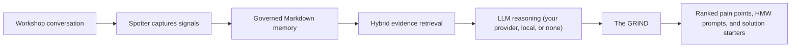
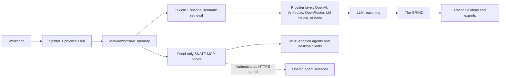
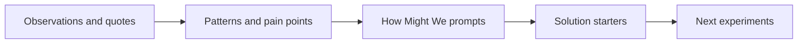
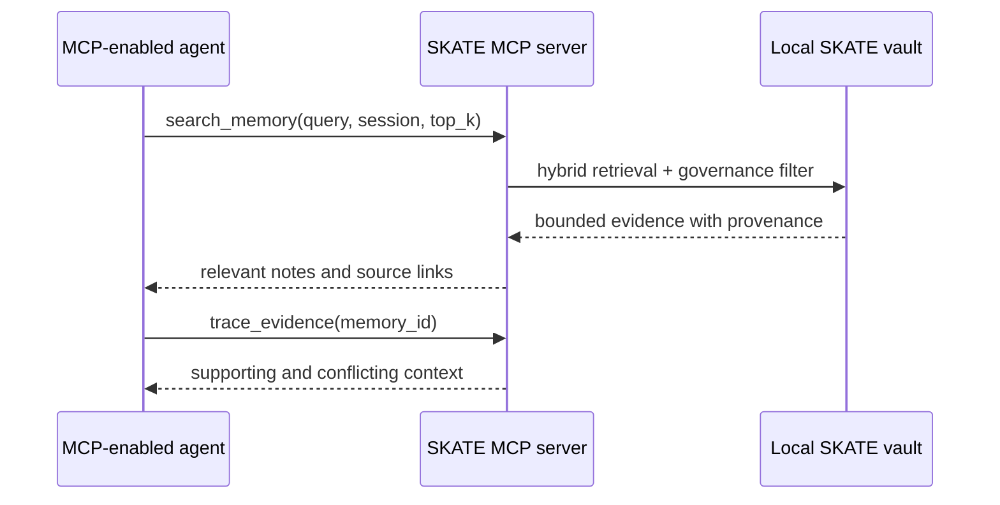

<p align="center">
  
</p>

<h1 align="center">SKATE</h1>

<p align="center"><strong>Scalable Knowledge Architecture &amp; Technology Engine</strong></p>

<h3 align="center">Local-first Workshop Memory &amp; Evidence-Based Improvement Engine</h3>

<p align="center">
  Turn live improvement workshops into governed organizational memory, retrieve only the evidence that matters, and generate traceable, ranked improvement opportunities your team can act on.
</p>

<p align="center">
  
  
  
  
  
  <a href="LICENSE"></a>
</p>

<p align="center">
  <a href="https://orionhackathon.devpost.com/"></a>
</p>

<p align="center">
  <strong><a href="https://orionhackathon.devpost.com/">OrionHackathon 2026</a> | Productivity &amp; Enterprise Solutions</strong><br>
  <a href="#">Demo video (link coming with submission)</a>
</p>

> *You can't vibe code personality.* SKATE keeps the human judgment, context, and lived experience in the room while AI does the work of organizing evidence and turning it into action.

---

## Hackathon submission

| | |
|---|---|
| **Event** | [Orion Global Hackathon 2026](https://orionhackathon.devpost.com/) — Where Operations Research Meets Innovation |
| **Category** | **Productivity & Enterprise Solutions** |
| **Also relevant to** | Artificial Intelligence & Machine Learning |
| **Team** | Kyle Kramer (solo) |
| **Built during the hackathon period** | The Lineup (action management), vendor-agnostic AI provider selection (OpenAI, Anthropic, OpenRouter, LM Studio, or none), Claude Desktop MCP setup, reasoning-effort mapping across providers, skater levels on the Stats page, refreshed Harborlight demo vault, and this documentation |

---

## The problem

Operations improvement lives and dies in workshops: kaizen events, root-cause sessions, design-thinking sprints, voice-of-customer reviews. These sessions create some of an organization's most valuable knowledge — and some of its most disposable. Observations, decisions, pain points, quotes, and unanswered questions disappear into notebooks, raw meeting transcripts, and disconnected AI summaries. When a team revisits the work, it either starts over or sends an entire transcript back to a model and hopes the important evidence is still visible.

The result is a measurable operations problem: repeated discovery work, decisions divorced from their supporting evidence, and improvement actions that lose their provenance the moment the meeting ends.

## The solution

**SKATE is a workshop operating system, not another note-taking app.** It captures natural meeting notes, preserves important signals as typed and linked memory, retrieves a bounded evidence set for AI reasoning, and turns that evidence into a traceable, ranked design-thinking synthesis — from observations to pain points to How-Might-We prompts to concrete solution starters.



## Where operations research meets innovation

SKATE treats a workshop as a data-generating process and applies a disciplined pipeline to it:

- **Structured capture** — free-form notes carry compact typed signals (`#O` observation, `#P` pain, `#Q` question, `#A` action) so qualitative data enters the system already classified.
- **Governed evidence** — every memory object has YAML metadata, active/inactive status, themes, provenance, and typed relationships (`supports`, `contradicts`, `causes`, `leads_to`, `references`). Analysis runs only on governed, in-scope evidence.
- **Bounded retrieval instead of brute force** — weighted lexical scoring plus optional local semantic embeddings return a small, ranked Top-K evidence set instead of an entire transcript. On the committed demo vault, the query `families repeat their story` scoped to a 13-note session with `top_k=3` returned an estimated 378 tokens of evidence versus approximately 2,412 tokens for the eligible session notes — an estimated 84.4% context reduction for that query (deterministic lexical-mode estimate, not a universal claim).
- **Traceable synthesis** — every generated pain point, How-Might-We prompt, and solution starter links back to its source notes, so decisions keep their evidence chain.
- **Prioritized output** — the full ranked synthesis exports to Excel for a workshop readout or an improvement backlog.

## What works today

| Capability | Status |
|---|---|
| Local-first Markdown/YAML memory with typed relationships | Working |
| Spotter and Spotter Live workshop capture | Working |
| Live transcription and spoken agent talk-back (OpenAI realtime voice) | Working |
| Local Whisper and optional ElevenLabs speaker diarization | Working |
| 2D/3D knowledge graph and Excel export | Working |
| GRIND design-thinking synthesis | Working |
| Choice of AI provider: OpenAI, Anthropic, OpenRouter, local LM Studio, or no AI at all | Working — new for this hackathon |
| The Lineup for flexible, session-linked, and recurring Standard Work actions | Working — new for this hackathon |
| Skater levels: gamified progress from Grom to 900 Legend on the Stats page | Working — new for this hackathon |
| Read-only MCP server for MCP-enabled agents (STDIO and Streamable HTTP) | Working |
| One-click MCP setup for both Codex/ChatGPT desktop and Claude Desktop | Working — new for this hackathon |
| Windows installer with bundled MCP executable | Working |

## Six core capabilities

- **Governed local memory** — human-readable Markdown with YAML metadata, active/inactive governance, themes, provenance, and typed relationships such as `supports`, `contradicts`, `causes`, `leads_to`, and `references`.
- **Evidence-backed retrieval** — weighted lexical search plus optional local semantic embeddings retrieves a small, relevant evidence set instead of repeatedly loading a complete vault or transcript.
- **Spotter and Spotter Live** — capture manual notes, listen to a room with live transcription, and hear Spotter respond with voice. Local Whisper provides a private fallback; ElevenLabs remains optional for realtime speaker labels.
- **The GRIND** — explore memory as a 2D/3D graph, identify patterns across a session, generate IDEO-style outputs, trace results to source notes, and export the full ranked synthesis to Excel.
- **The Lineup** — manage flexible or session-linked Action Items, mark completed work as Landed, maintain daily/weekly/monthly Standard Work, and promote `#A` bullets from ordinary notes into traceable checklist items.
- **A physical workshop interface** — an Elgato Stream Deck Neo and a custom skateboard-wheel microphone puck give the agent a practical human-machine interface in the room.

## Why SKATE is different

| Traditional AI notes | SKATE |
|---|---|
| Produces a meeting summary | Builds governed organizational memory |
| Sends a full transcript as context | Retrieves a bounded set of relevant evidence |
| Stores flat pages or informal backlinks | Maintains typed evidence and causal relationships |
| Centers a chat box | Operates as a workshop capture and synthesis system |
| Applies generic summarization | Follows a design-thinking path from evidence to action |
| Hides the source of an answer | Links outputs back to inspectable source notes |
| Ends with prose | Produces ranked pain points, How-Might-We prompts, solution starters, and Excel outputs |
| Loses follow-through in meeting notes | Surfaces captured actions in The Lineup and preserves their source-note link |

Obsidian is an excellent personal knowledge workspace. SKATE addresses a different job: helping facilitators and improvement teams convert a live, multi-person workshop into governed, reusable evidence and then deliberately synthesize that evidence into improvement opportunities.

## Architecture



The local vault remains the source of truth. Search indexes and embeddings are rebuildable acceleration layers, not proprietary memory. Cloud services are explicit and optional except when the user requests their capabilities.

## Bring your own AI — or none at all

SKATE is deliberately not locked to any AI vendor. Pick the reasoning engine that fits your privacy posture and budget in Settings:

| Provider | What it means |
|---|---|
| **No AI** | Every non-model feature still works: capture, governance, retrieval, graphs, The Lineup, exports, and a deterministic local synthesis. Nothing ever leaves the machine. |
| **LM Studio** | A local LLM on your own hardware through LM Studio's OpenAI-compatible server. Private reasoning, no API key. |
| **OpenAI** | GPT-5.6 family through the Responses API, with selectable reasoning effort. |
| **Anthropic** | Claude Sonnet, Opus, or Haiku through the Messages API. |
| **OpenRouter** | Any hosted model — Claude, GPT, Gemini, Llama, Mistral — with a single key. |

The same vendor-agnostic stance applies to agent access: the installer can register SKATE's MCP server with **Codex/ChatGPT desktop and Claude Desktop** in one click each.

## AI reasoning: synthesis, not summarization

The central AI task in SKATE is not "summarize this meeting." It is a constrained, evidence-heavy reasoning problem across multiple notes: recognize recurring tensions, distinguish observations from proposed solutions, preserve source traceability, reframe problems without embedding a preferred answer, and generate concrete starting points for experimentation.

The reasoning pipeline (implemented in [`ui/app.py`](ui/app.py), routed through the provider selected in Settings):

1. **GRIND synthesis** reads the active evidence in a selected session.
2. **Pattern detection** identifies repeated pains, unmet needs, risks, and contradictions.
3. **Design-thinking reframing** creates divergent How-Might-We prompts.
4. **Solution synthesis** proposes concrete, evidence-linked solution starters.
5. **Spotter coaching** uses session memory to assist a facilitator during the workshop.

## The GRIND

GRIND is the part of SKATE where workshop memory becomes forward motion. It reads the signals people captured in the room and follows a design-thinking progression:



GRIND respects note and session governance: inactive notes are retained in the vault but excluded from analysis, and inactive sessions do not appear as GRIND targets. Its outputs stay connected to evidence:

- **Pain Points** describe what is broken or difficult for people, based on repeated signals.
- **How Might We prompts** open the problem space without prescribing a solution.
- **Solution Starters** turn evidence into specific moves a team can evaluate or prototype.
- **Open** returns the reviewer to the originating note.
- **Export IDEO Excel** provides the complete ranked output for a workshop readout or backlog.

The 2D and 3D views make the same memory inspectable as a network of notes, themes, and typed rails. The graph is not the memory system itself; it is a lens for seeing relationships that are difficult to notice in a folder of documents.

## MCP: the agent-memory interface

SKATE's read-only MCP server lets any MCP-enabled agent ask for the smallest useful slice of workshop memory rather than receiving an entire meeting transcript. MCP is the interface; SKATE's governed Markdown, relationships, retrieval, and provenance remain the memory architecture behind it.



Available tools:

| Tool | Purpose |
|---|---|
| `list_active_sessions` | Show the workshop memories available to an agent |
| `search_memory` | Return a small ranked evidence set for a query |
| `get_memory_object` | Read one complete governed memory object |
| `get_session_context` | Retrieve a bounded overview of one session |
| `trace_evidence` | Follow provenance and typed relationships |
| `get_grind_outputs` | Retrieve the most recent design-thinking synthesis |
| `search` / `fetch` | Compatibility tools for knowledge and research surfaces |

### Connect SKATE memory to an agent

- **Installed app:** check the Codex and/or Claude Desktop boxes in the installer, or run `Configure SKATE MCP for Codex.bat` / `Configure SKATE MCP for Claude Desktop.bat` from the installation folder, then restart the desktop client.
- **Source checkout:** run either configure script after the Python environment has been created by `Start SKATE.bat`.
- **Hosted/web agents:** run `Start SKATE MCP HTTP.bat`, keep the endpoint private at `http://127.0.0.1:8766/mcp`, and connect it through an authenticated HTTPS tunnel. Never expose the unauthenticated local endpoint directly to the internet.
- **Test prompts:** ask the agent to list active sessions, search for bounded evidence, trace relationships around a pain point, or retrieve the latest GRIND output. MCP returns only requested governed evidence; it does not upload the full vault by default.

## Spotter: an AI workshop agent with an HMI

<p align="center">
  
</p>

### Why the name "Spotter"?

In skateboarding, the person attempting the trick is not entirely alone. A **spotter** watches the surrounding environment, looks out for approaching hazards, helps determine when the path is clear, and supports the skater without taking over the attempt. The role is an alert, trusted safety net operating just outside the spotlight.

SKATE's Spotter serves the same purpose in a workshop. The facilitator still leads the room and makes the judgment calls; Spotter listens at the edge of the session, preserves important signals, identifies risks and gaps, and helps the team move forward without replacing the human leading the work.

Spotter helps capture pains, observations, questions, actions, solutions, recommendations, and insights without forcing the facilitator to disengage from the room. Spotter Live can maintain a timestamped transcript with live transcription and speak responses aloud. Local Whisper keeps transcription on the machine, while optional ElevenLabs Scribe Realtime adds speaker diarization such as Speaker 1 and Speaker 2.

### Stream Deck Neo control surface

<p align="center">
  
</p>

The Stream Deck turns facilitation methods into one-press stances: Observe, Find Waste, 5 Whys, How Might We, Frame, Test, Start, and Stop. The facilitator can change the agent's mode without breaking eye contact or navigating a menu. Custom icons and the hotkey map are in [`streamdeck-neo-icons/`](streamdeck-neo-icons/).

### Skate-wheel microphone puck

<p align="center">
  
</p>

The custom 3D-printed skateboard-wheel housing holds a conference microphone array at the center of the table. It gives the otherwise invisible agent a memorable, understandable place in the workshop. Build files and the hardware guide are in [`hardware-spotter-mic-puck/`](hardware-spotter-mic-puck/).

## Demo scenario: Harborlight

The repository includes **fictional nonprofit workshop material** for Harborlight. It demonstrates the product without exposing client or personal data.

A judge can follow this story:

1. Open a Harborlight workshop session and review realistic, human-style meeting notes.
2. Notice plain text mixed with compact capture signals such as `#O` observation, `#P` pain, `#Q` question, and `#A` action.
3. Use Spotter or Spotter Live to add workshop evidence.
4. Inspect the session in the 2D or 3D knowledge graph.
5. Select the active session and click **Start the GRIND**.
6. Review pain points, How-Might-We prompts, and solution starters.
7. Use **Open** to trace an output back to its source note.
8. Check **The Lineup** to see captured `#A` actions as traceable checklist items.
9. Export the complete ranked synthesis to Excel.

## Run SKATE

### Fastest path on Windows

**Requirements:** Windows and Python **3.10–3.13**. During Python installation, select **Add Python to PATH**.

```powershell
git clone https://github.com/SixSigmaEngineer/skate-workshop-os.git
cd skate-workshop-os
```

Then double-click **`Start SKATE.bat`**. On first run it creates a private `.venv`, installs the required packages, starts the local service, and opens the SKATE native app window. Use **`Stop SKATE.bat`** to stop the local service.

Open **Settings** and choose an AI provider — OpenAI, Anthropic, OpenRouter, a local LM Studio server, or **No AI** for a fully offline experience. An OpenAI key additionally powers live transcription and spoken agent responses; an ElevenLabs key is optional and only needed for speaker diarization. For fully local transcription, run **`Install Local Whisper.bat`** once and restart SKATE.

### Manual development run

```powershell
py -3.13 -m venv .venv
.venv\Scripts\python -m pip install -r ui\requirements.txt
.venv\Scripts\python ui\app.py
```

The local service binds to `127.0.0.1:8765`. Add `--reload` for development or `--browser` only when you intentionally want the browser version.

### Optional services

| Capability | Requirement |
|---|---|
| GRIND and Spotter reasoning | OpenAI, Anthropic, or OpenRouter API key — or LM Studio locally, or none |
| Local audio/video transcription | Local Whisper installation |
| Live transcript and spoken Spotter responses | OpenAI API key (realtime voice models) |
| Optional realtime speaker diarization | ElevenLabs API key and Scribe Realtime |
| Local semantic retrieval | FastEmbed or Ollama with `nomic-embed-text` |
| Basic retrieval and manual notes | No cloud service required |

## Privacy and governance

- Notes, sessions, and transcripts are stored as local files under the SKATE project or vault.
- Markdown and YAML are readable without SKATE and can be versioned, backed up, moved, or inspected with ordinary tools.
- Local Whisper can transcribe recordings without uploading the media to a cloud speech provider.
- Optional semantic embeddings can run locally and are cached by content hash.
- The server binds to `127.0.0.1`, not a public network interface by default.
- `settings.json`, private conversations, transcripts, logs, and local model artifacts are excluded through `.gitignore`.
- Content leaves the computer only when the user invokes a configured cloud capability such as AI reasoning/voice or optional ElevenLabs speech.
- Active/inactive status controls whether a note or session participates in GRIND analysis.

## Technology stack

| Layer | Technology |
|---|---|
| Application | Python, FastAPI, Jinja2, pywebview |
| AI reasoning | Selectable: OpenAI (Responses API), Anthropic (Messages API), OpenRouter, local LM Studio, or none |
| Memory | Markdown, YAML frontmatter, typed relationships |
| Retrieval | Weighted lexical scoring, optional FastEmbed or Ollama embeddings |
| Speech | OpenAI realtime transcription and voice; Local Whisper fallback; optional ElevenLabs diarization |
| Visualization | Custom 2D/3D WebGL knowledge graph |
| Export | Excel workshop synthesis |
| Physical HMI | Elgato Stream Deck Neo and custom microphone housing |
| Agent access | Official MCP Python SDK; STDIO and Streamable HTTP |

## Repository map

```text
skate-workshop-os/
|-- ui/                         application, routes, templates, and static assets
|-- demo-vault/                 fictional Harborlight demonstration material
|-- workshop-knowledge-documents/ facilitation and methodology corpus (user-supplied)
|-- streamdeck-neo-icons/       physical-control icons and hotkey map
|-- hardware-spotter-mic-puck/  microphone enclosure files and build guide
|-- mcp_server/                 governed MCP tools and transports
|-- tests/                      automated test suite
|-- tools/                      project utilities
|-- Start SKATE.bat             one-click Windows launcher
|-- Stop SKATE.bat              local-service stop command
|-- TECH_STACK.md               deeper implementation notes
`-- LICENSE                     MIT license
```

## Future roadmap

- Cross-session pattern analysis: detect recurring pains and themes across an entire program of workshops, not just one session.
- Team deployments: shared vaults with role-based governance for improvement programs.
- Deeper analytics: frequency, co-occurrence, and trend views over typed signals to support prioritization.
- macOS and Linux launchers.
- Write-capable MCP tools with explicit human approval gates.

## Team

Built by **Kyle Kramer** — a continuous-improvement practitioner who facilitates real operations workshops and built SKATE to fix the evidence-loss problem he lives with every week. The problem framing, facilitation philosophy, memory architecture, physical interface, and product decisions come from that practice; AI-assisted development accelerated the implementation, and LLM reasoning powers the product's synthesis at runtime.

## License

SKATE is available under the [MIT License](LICENSE). Hardware components and third-party services remain subject to their respective licenses and terms.

---

**SKATE turns conversations into memory, memory into evidence, and evidence into better ideas.**

<p align="center">
  <br>
  <sub><a href="https://octodex.github.com/skatetocat">Skatetocat</a> © GitHub, from the <a href="https://octodex.github.com/">Octodex</a></sub>
</p>
